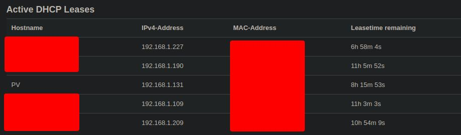
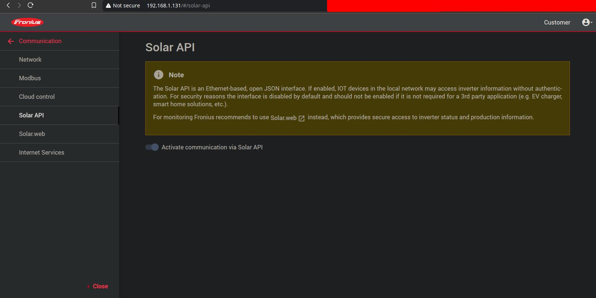
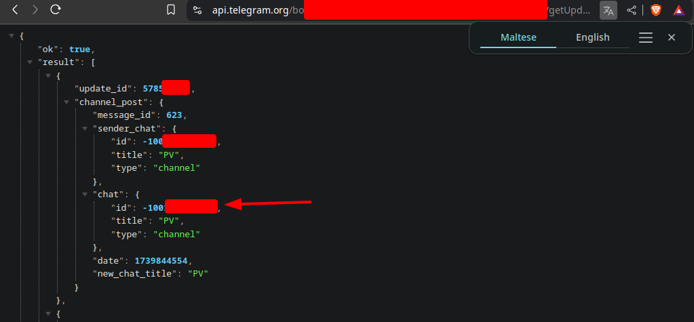
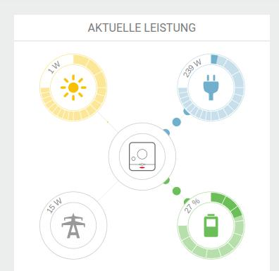

# Fronius Solar Monitor 🌞⚡

This Python script monitors solar power data from the **Fronius Solar API** and sends Telegram alerts when the battery is full or no longer full.

## Overview

**Fronius Solar Monitor** helps you optimize your solar energy consumption by alerting you when your battery reaches full capacity or drops below it. Perfect for regions where excess energy fed to the grid isn't compensated beyond certain limits.

## 🌍 Why Use This Monitor?

- **Cost Optimization**: Maximize self-consumption when excess grid feed-in isn't compensated
- **Smart Energy Management**: Know exactly when to turn devices on/off
- **Integration Potential**: Use as part of your larger home automation system

## 🚀 Key Features

- Real-time battery status monitoring via Fronius Solar API
- Customizable alert thresholds and check intervals
- Telegram notifications to your phone or group
- Comprehensive logging for system analysis
- Multi-language support (English, German)

---

## 🔧 Installation & Setup

### Prerequisites

- Python 3.x
- A Fronius inverter with Solar API enabled
- Telegram account

### Step 1: Install Dependencies

```bash
pip install requests
```

### Step 2: Enable the Fronius Solar API

The **Solar API** must be enabled on **Fronius GEN24** devices to avoid 404 errors.

#### How to Enable:

1. **Access the Fronius Web Interface**
   - Enter your Fronius inverter's IP address in a browser
   - Find the IP through:
     - Your router's device list
     - The IP configured during installation
     - Network scanning tools
   
   

2. **Enable the API**
   - Navigate to **Communication → Solar API**
   - Toggle the **Solar API** setting to enabled
   - Save your changes
   
   

### Step 3: Create a Telegram Bot

1. **Create Your Bot**
   - Open Telegram and search for **@BotFather**
   - Send `/newbot` and follow the instructions
   - Save the **Bot Token** provided

2. **Configure Chat ID**
   - For a **group chat**: Add your bot to a group
   - For a **private chat**: Start a conversation with your bot
   - Send any message to the bot
   - Get your Chat ID by opening:
     ```
     https://api.telegram.org/bot<TOKEN>/getUpdates
     ```
   - Note: Group chat IDs are negative numbers; private chat IDs are positive

   

### Step 4: Configure the Application

Rename `_config.json` to `config.json` and configure it with your settings:

```json
{
  "telegram_token": "6467835642:AAAAAl99Ue14-e2cPqF79KSdOol5-aTr123",
  "chat_id": "-1048737232455",
  "solar_api_ip": "192.168.1.131",
  "check_interval_min": 1,
  "consecutive_full_checks": 1,
  "consecutive_not_full_checks": 4,
  "language": "en"
}
```

#### Configuration Parameters:

| Parameter | Description | Recommended Value |
|-----------|-------------|-------------------|
| `telegram_token` | Your Telegram bot token | - |
| `chat_id` | Target chat ID for notifications | Negative for groups, positive for private chats |
| `solar_api_ip` | IP address of Fronius inverter | Local network IP |
| `check_interval_min` | Time between checks (minutes) | 1-5 |
| `consecutive_full_checks` | Readings needed before "battery full" alert | 1-3 |
| `consecutive_not_full_checks` | Readings needed before "battery not full" alert | 2-5 |
| `language` | Notification language | "en" or "de" |

> **Note:** Higher `consecutive_checks` values reduce false alerts but increase notification delay.

### Step 5: Run the Monitor

#### Manual Execution

```bash
python solar_monitor.py
```

#### Automatic Startup on Raspberry Pi (DietPi)

For a headless setup on Raspberry Pi running DietPi:

1. **Install DietPi**: Download from [dietpi.com](https://dietpi.com/docs/install/)

2. **Access via SSH**:
   ```bash
   ssh root@192.168.1.132  # Replace with your Pi's IP
   ```

3. **Install Requirements**:
   - Install Git and Python via dietpi-software
   - Clone the repository:
     ```bash
     git clone https://github.com/Persie0/Fronius-Solar-Monitor.git
     cd Fronius-Solar-Monitor
     ```

4. **Setup Auto-Start (Quick Method)**:
   
   Simply run the setup script included in the repository:
   ```bash
   sudo bash setup_autostart.sh 
   ```

5. **Reboot to test**:
   ```bash
   reboot
   ```

> **Note:** If you need to modify the autostart behavior, you can edit `/var/lib/dietpi/dietpi-autostart/custom.sh` directly.

---

## 📡 Data Monitoring & API

### Example API Request

To manually check your system's status, enter in your browser:
```
http://192.168.1.131/solar_api/v1/GetPowerFlowRealtimeData.fcgi
```
(Replace with your inverter's IP)

### Sample API Response:

```json
{
  "Body": {
    "Data": {
      "Inverters": {
        "1": {
          "Battery_Mode": "battery full",
          "P": 4201.64,
          "SOC": 100
        }
      },
      "Site": {
        "P_Grid": 740.7,
        "P_Load": -4942.34,
        "P_PV": 4298.14,
        "rel_Autonomy": 85.01,
        "rel_SelfConsumption": 100
      }
    }
  },
  "Head": {
    "Status": { "Code": 0 },
    "Timestamp": "2025-02-18T14:50:13+00:00"
  }
}
```

### Data Visualization

#### Web Interface


#### API Response Values Explained


### Power Flow Interpretation:
- **P_Grid**: Power from/to grid (positive = importing; negative = exporting)
- **P_Load**: Current power consumption (negative value)
- **P_PV**: Current solar production
- **SOC**: Battery state of charge (percentage)
- **rel_Autonomy**: Percentage of current usage from your own sources
- **rel_SelfConsumption**: Percentage of produced energy used locally

## 📚 Additional Resources

For detailed API documentation:
- [fronius-json-tools](https://github.com/akleber/fronius-json-tools)
- [Fronius Solar API Documentation (PDF)](docs/docs.pdf)

## 🛠️ Troubleshooting

| Issue | Solution |
|-------|----------|
| 404 Error | Verify Solar API is enabled in Fronius Web UI |
| No Telegram messages | Check bot token and chat ID configuration |
| Connection refused | Verify inverter IP address and network connectivity |
| Script crashes | Check logs for details; ensure Python dependencies are installed |

---

## 📋 System Requirements

- **Supported Inverters**: Fronius GEN24 series
- **Operating System**: Any Python-compatible OS (Linux recommended)
- **Python**: 3.6 or higher
- **Network**: Local network access to Fronius inverter

---

**Happy Solar Monitoring! 🌞⚡**