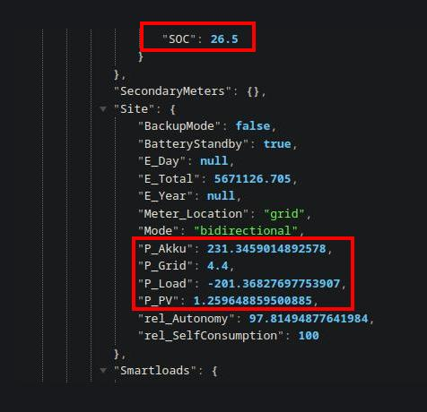

# Solar Monitoring Bot

This Python script monitors solar power data from the **Fronius Solar API** and sends alerts via Telegram when specific conditions are met. It checks for:
- **Excess solar production** (when battery SOC > 97% and solar input is higher than load consumption).
- **High power consumption** (when consumption exceeds solar input and SOC < 97%).

## 🌍 Why This Project?
In some regions, you are not allowed to feed excess solar energy into the grid beyond a certain amount. This script helps you monitor energy usage so you can turn off/on devices accordingly to stay within regulations and optimize energy consumption.
You can use the code in your own projects to e.g. automate turning on/off things.

## 🚀 Features
- Dynamic configuration via `config.json`
- Automatic Telegram notifications
- Logging for debugging and monitoring

---

## 🔧 Setup Instructions

### 1️⃣ Install Dependencies
```bash
pip install requests
```

### 2️⃣ Set Up Fronius API
The **Solar API** needs to be enabled on **Fronius GEN24** devices. If the API is disabled, any request will return a **404-HTTP error** with the message: _"Solar API disabled by customer config"._

#### 🔹 How to Enable the Solar API:
1. **Access the Fronius Web Interface:**
   - Open a browser and enter the IP address of your Fronius inverter. You can find this IP:
     - In the **router's web interface** (look for your inverter's name in the device list).
     - If you set the IP during setup, use that.
     - With network scanner tools / apps

2. Navigate to: **Communication → Solar API**.

3. Enable the **Solar API** feature.
4. Save settings.

---

### 3️⃣ Create a Telegram Bot
(A more in depth tutorial is [here](https://core.telegram.org/bots/tutorial#obtain-your-bot-token)
1. Open Telegram and search for **@BotFather**.
2. Send `/newbot` and follow the instructions.
3. Copy the **Bot Token** and paste it into `config.json`.
4. Add your bot to a group and get the **Chat ID** by opening this url in your browser, replace \<TOKEN> with your actual token.
   ```bash
   https://api.telegram.org/bot<TOKEN>/getUpdates
   ```

### ➡️ Send Messages to a Private Chat Instead of a Group
If you prefer to receive alerts as **private messages** instead of in a group:
1. Start a chat with your bot.
2. Send any message.
3. Get your chat ID by opening this url in your browser
   ```bash
   https://api.telegram.org/bot<TOKEN>/getUpdates
   ```
4. Copy the chat ID (it will be a **positive number**, unlike group IDs which are negative).
5. Replace the `chat_id` value in `config.json` with your personal chat ID:
   ```json
   {
     "telegram_token": "your-telegram-bot-token",
     "chat_id": "your-personal-chat-id",
     "solar_api_ip": "xxx.xxx.xxx.xxx",
     "condition_duration_min": 3,
     "check_interval_min": 1
   }
   ```

### 4️⃣ Configure `config.json`
Edit `config.json` to match your setup:
```json
{
  "telegram_token": "6467835642:AAAAAl99Ue14-e2cPqF79KSdOol5-aTr123",
  "chat_id": "-1048737232455",
  "solar_api_ip": "192.168.1.131",
  "condition_duration_min": 3,
  "check_interval_min": 1
}
```

### 5️⃣ Run the Script
```bash
python solar_monitor.py
```

---

## 📡 Example API Response
This is what the Fronius solar API returns:
```json
{
  "Body": {
    "Data": {
      "Inverters": {
        "1": {
          "SOC": 98
        }
      },
      "Site": {
        "P_PV": 5000,
        "P_Load": 3000
      }
    }
  }
}
```

### 🔹 Web Interface Screenshot


### 🔹 API Response Equivalent


---

## 📜 API Documentation
For a detailed API reference for the **Fronius Solar API**, check the official documentation:
📄 **[Fronius Solar API Docs (PDF)](docs/docs.pdf)**

---

## 🛠️ Troubleshooting
- If the script doesn't run, check that your **API IP address** is correct.
- Make sure your Telegram bot is added to the correct group or private chat.
- If you get a **404 error**, ensure the **Solar API is enabled** in the Fronius Web UI.

**Happy Monitoring! 🌞⚡**

